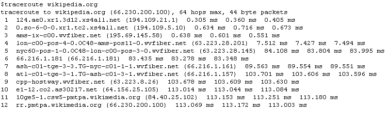
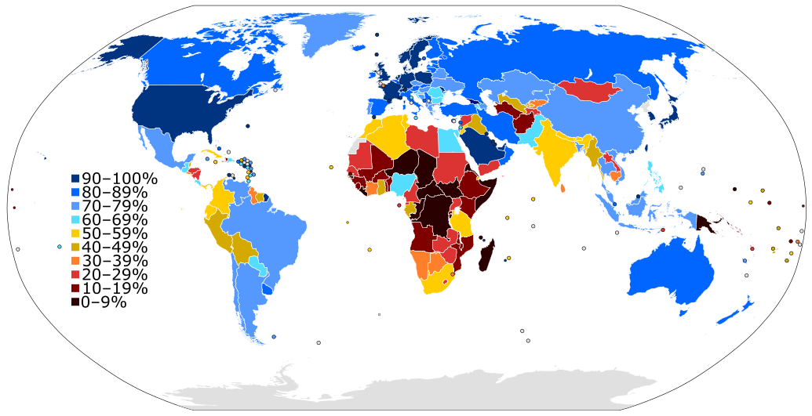

# NetVerse CS602 - Interactive Network Lab


A visually rich, hands-on networking lab where students learn **routing decisions**, **path changes**, and **real internet route behavior** by building and experimenting.

## Visual Learning (Wikimedia)

### Dijkstra Routing Animation (GIF)


### Traceroute Sample (PNG)


### Global Internet Penetration Map (SVG)


Attribution and licenses: [assets/wikimedia/ATTRIBUTION.md](assets/wikimedia/ATTRIBUTION.md)

## Repo Model
- `main` branch: instructor-controlled and protected
- Student branches: `student-001` to `student-138`
- Branch workflow: individual primary, collaboration visible for learning
- Read access: open for exploration and peer learning

## What Students Learn
- Packet forwarding and route selection
- Shortest-path routing (Dijkstra)
- Route recomputation after link failures
- Traceroute interpretation hop-by-hop
- Prefix and ASN-level internet routing context (BGP perspective)

## Interactive Simulator
Starter simulator lives in [`network-lab-starter`](network-lab-starter):
- 3 topology presets (campus, ISP core, enterprise WAN)
- manual and auto packet traffic generation
- random link-failure injection and restore
- Dijkstra step trace with route metrics and event log
- live routing table snapshot for all nodes

Run by opening: `network-lab-starter/index.html`

## Real-World Router Experience (PowerShell)
Use these scripts on Windows PowerShell to gather live routing intelligence:

### 1. Hop-by-hop path + ISP/ASN enrichment
```powershell
./scripts/powershell/Get-NetworkPathIntel.ps1 -Target 8.8.8.8
```

### 2. Prefix-level BGP intelligence (RIPEstat)
```powershell
./scripts/powershell/Get-BgpPrefixIntel.ps1 -Prefix 8.8.8.0/24
```

### 3. One-command full diagnostics flow
```powershell
./scripts/powershell/Invoke-NetLabDiagnostics.ps1 -Target 1.1.1.1 -Prefix 1.1.1.0/24
```

## Student Onboarding / Invitations
Email pattern supported: `<ROLLNO>@rjit.ac.in`

- Template roster: [`data/student_roster_template.csv`](data/student_roster_template.csv)
- Bulk org invite script: [`scripts/invite_students_from_csv.ps1`](scripts/invite_students_from_csv.ps1)

Dry run:
```powershell
./scripts/invite_students_from_csv.ps1 -CsvPath ./data/student_roster_template.csv
```

Actual invites:
```powershell
./scripts/invite_students_from_csv.ps1 -CsvPath ./data/student_roster_template.csv -SendInvites
```

Retry mode with backoff + remainder export:
```powershell
./scripts/invite_students_from_csv.ps1 -CsvPath ./data/student_roster_template.csv -SendInvites -MaxRetries 3 -BaseDelaySeconds 20 -RemainingCsvPath ./data/invite_remaining.csv
```

## Important
- Current branch numbering model is for this cohort.
- Future cohorts can reuse this repo with a different mapping strategy.
- Keep `main` protected to prevent accidental destructive changes.
